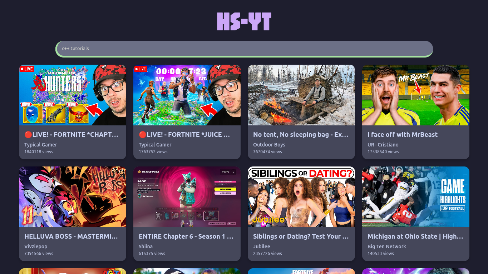
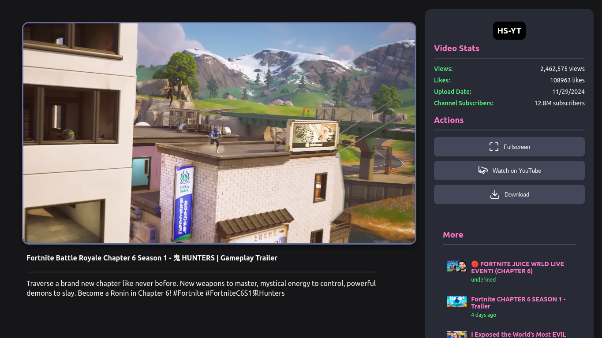

# HS-YT
Simple, Minimal YouTube Client | Submission for High Seas

### Homepage

### Viewer

## Description

This is a YouTube viewer without a lot of the features that YouTube puts on top; this leads to a much less laggy experience, while keeping yourself pseudo-anonymous (see below). 

I say "pseudo-anonymous" because the embed goes through a different YouTube embed URL: "youtube-nocookie" and therefore cookies are obviously not transferred from `youtube.com`. Which means your account is not associated with what you're watching. However, this is not as anonymous as something like the server sending you the raw video through a custom player which would incur much more egress and possible delay for the viewer.

I made this for High Seas but I also made this because the YouTube client was pretty laggy for my device, but alternative clients like Invidious had unfavorable delays because the video goes through the server and I was personally fine with the YouTube player but the client itself was kind of laggy.

This is a compromise of both: an alternative client with much less lag, while keeping the official YouTube player.

## Main Points

- Your account is NOT associated with your searches or views!
- You don't get any ads, even without an ad-blocker.
- Livestreaming works beautifully
- Much less on-load lag than the main YouTube website
- People hosting don't need to worry about data usage since YouTube embedding is used.

## To Use

You can use the official demo link:

https://barex.doxr.hackclub.app/

## To Host

This uses:

`node` (Node.js) + `npm`

`youtubei` (not `youtubei.js`) - NPM Dependency

`express` - NPM Dependency

Start by cloning the repo. Ensure you have `git`, Node.js, and `npm` (should come with Node.js) installed!

`git clone https://github.com/DoxrGitHub/hs-yt.git`

Then enter it and install npm dependencies.

`cd hs-yt; npm install`

If you want to save a little bit of space you can run `rm -rf backup`

Finally, run

`node main.js 3000`

You can replace 3000 with your preferred port. On subsequent installs you can just enter the hs-yt directory and run the above command. 

<small>You may need to set up https/SSL through a reverse proxy or something</small>

## Future

I may add:

- Better Shorts Support (unlikely)
- Better "More Videos"
- Integrated video downloading instead of redirection to a different project
- "Load More Search Results" button
- Better Mobile Support (sorry!)
- Channel Page Support

## Credits

Doxr: development

Invidious instances: main trending page API

`youtubei`* - a lot of internal YouTube interactions

<small>If you see package.json, I use a custom version of `youtubei`, because at the time I found it, it was giving errors. However, I patched some of them and put it on a repo. If it gets fixed I'll replace it with the official npm module. I stuck with youtubei because it used the InnerTube API directly and the server response didn't give me bot errors like it did with `youtubei.js`, for whatever reason.</small>